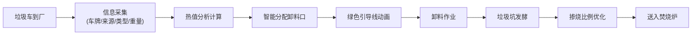
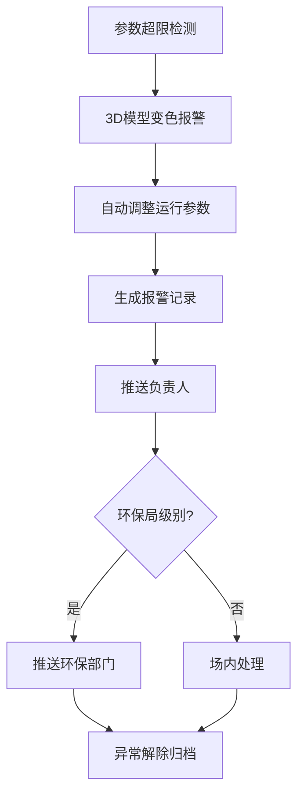

# 3D智慧垃圾焚烧发电厂综合运营与环保监管可视化平台 - 产品需求文档

## 1. 产品概述

本平台是基于WebGL/Three.js的3D可视化运营监管系统，通过沉浸式三维场景实时展示垃圾焚烧发电厂的全流程运营状态，实现智能调度、环保监控、设备管理和数据分析的一体化解决方案。

- 核心目标：构建集运营调度、环保监管、设备运维于一体的智慧电厂可视化平台
- 目标用户：发电厂厂长、运营部长、环保局监管人员
- 市场价值：提升电厂运营效率30%，降低环保违规风险，实现设备全生命周期管理

## 2. 核心功能

### 2.1 用户角色与权限

| 角色 | 登录方式 | 核心权限 |
|------|----------|----------|
| 厂长 | 人脸识别 | 全厂数据查看、运营决策、报表审批、权限管理 |
| 部长 | 人脸识别 | 日常运营调度、设备管理、工单处理、报表导出 |
| 环保局 | 人脸识别+密钥 | 环保排放数据监控、超标报警接收、历史数据追溯 |

### 2.2 功能模块

1. **3D厂区总览**：全厂3D场景漫游、设备实时状态展示、数据可视化面板
2. **垃圾车调度系统**：车辆信息展示、智能卸料分配、绿色引导线动画
3. **垃圾坑管理**：堆料高度/发酵天数/热值分布可视化、智能掺烧比例计算
4. **焚烧炉监控**：实时参数监控、超限报警、自动给料/风门调整动画
5. **汽轮发电机系统**：振动监测、自动降负荷、维修工单生成
6. **烟气净化系统**：SO₂/NOx/颗粒物实时监测、超标喷淋动画、环保部门推送
7. **灰渣仓管理**：仓位监控、满仓预警、运输车辆调度
8. **设备寿命管理**：运行时长统计、大修工单自动生成、备件提醒
9. **运营报表**：按日期导出Excel运营日报、发电量/排放/异常统计
10. **中央控制室**：综合数据大屏、报警管理、设备控制

### 2.3 页面详情

| 页面名称 | 模块名称 | 功能描述 |
|-----------|-------------|---------------------|
| 登录页 | 人脸识别登录 | 摄像头采集人脸、三级权限验证、登录日志记录 |
| 3D主控室 | 厂区3D场景 | 可交互3D模型、视角切换、设备点击查看详情 |
| 3D主控室 | 实时数据面板 | 发电量、处理量、排放指标、设备状态总览 |
| 3D主控室 | 报警管理区 | 实时报警弹窗、历史报警记录、报警级别分类 |
| 车辆调度 | 垃圾车列表 | 车牌、来源、垃圾类型、重量、状态实时显示 |
| 车辆调度 | 卸料引导 | 智能分配卸料口、绿色引导线动画指示 |
| 垃圾坑监控 | 3D坑体模型 | 堆料高度分层、发酵天数色标、热值热力图 |
| 垃圾坑监控 | 掺烧计算 | 自动计算最佳掺烧比例、3D色块区分不同批次 |
| 焚烧炉监控 | 单炉详情 | 炉膛温度、含氧量、蒸汽流量实时曲线 |
| 焚烧炉监控 | 报警联动 | 温度>1000℃或氧<6%模型变红、自动调整动画 |
| 汽轮机监控 | 振动监测 | 轴承振动实时数据、超标自动降负荷动画 |
| 汽轮机监控 | 工单管理 | 维修工单自动生成、处理状态跟踪 |
| 烟气净化 | 排放监测 | SO₂、NOx、颗粒物浓度实时显示、烟囱变红预警 |
| 烟气净化 | 喷淋动画 | 超标时3D喷淋效果、脱硫脱硝设备运行状态 |
| 灰渣仓 | 仓位显示 | 3D仓位高度、接近满仓橙色闪烁预警 |
| 灰渣仓 | 运输调度 | 自动调度运输车、装卸状态跟踪 |
| 设备管理 | 寿命台账 | 每台设备运行时长、下次大修倒计时 |
| 设备管理 | 大修工单 | 运行>8000小时自动生成工单、备件清单 |
| 报表中心 | 日报导出 | 按日期选择、Excel格式导出、含全量运营数据 |

## 3. 核心流程

### 3.1 垃圾入厂处理流程

垃圾车到达 → 车牌识别+信息录入 → 系统计算垃圾热值 → 智能分配最优卸料口 → 绿色引导线动画指引 → 卸料完成 → 垃圾坑发酵监测 → 掺烧比例计算 → 送入焚烧炉

### 3.2 异常报警处理流程

设备参数异常 → 3D模型变色预警 → 声光报警提示 → 自动调整设备运行参数 → 生成报警记录 → 推送相关人员 → 异常解除 → 归档分析

## 4. 用户界面设计

### 4.1 设计风格

- **主色调**：科技蓝(#00D4FF)作为主色，搭配工业灰(#1A1F2E)深色背景
- **辅助色**：报警红(#FF4757)、预警橙(#FFA502)、正常绿(#2ED573)、运行黄(#FFD93D)
- **视觉风格**：赛博工业风，深色科技感界面，发光边框，数据可视化元素
- **字体**：主标题使用 Orbitron 科技感字体，正文使用 Roboto 清晰易读
- **按钮风格**：发光圆角按钮，悬停时有辉光扩散动画
- **布局风格**：中央3D场景为主，四周悬浮数据面板，卡片式信息展示
- **图标风格**：线性科技图标，带发光效果

### 4.2 页面设计概览

| 页面名称 | 模块名称 | UI元素 |
|-----------|-------------|-------------|
| 登录页 | 人脸识别区 | 圆形摄像头取景框、扫描线动画、权限角色选择、科技感背景 |
| 3D主控室 | 中央场景区 | 全屏3D渲染、视角控制按钮、设备高亮可点击 |
| 3D主控室 | 顶部数据栏 | 关键指标卡片、实时时钟、报警数量角标、用户信息 |
| 3D主控室 | 左侧功能菜单 | 图标+文字导航、选中发光效果、可折叠 |
| 3D主控室 | 右侧信息面板 | 选中设备详情、参数列表、趋势图、控制按钮 |
| 3D主控室 | 底部报警栏 | 滚动报警信息、级别颜色区分、点击查看详情 |
| 子页面 | 内容区 | 3D小场景+数据表格组合、标签页切换、筛选条件 |

### 4.3 响应式设计

- 设计原则：桌面端优先，针对大尺寸监控屏优化
- 主场景自适应：3D画布根据窗口大小自动调整
- 面板布局：1920×1080及以上分辨率最优，支持2K/4K大屏
- 触控支持：平板设备可操作，按钮最小尺寸44px

### 4.4 3D场景设计指引

- **环境氛围**：工业厂区夜景风格，HDRI环境贴图，暖色调厂区灯光
- **光照设置**：主方向光模拟月光，辅助点光源模拟路灯和设备指示灯，全局环境光
- **相机设置**：默认俯视45°视角，支持轨道控制器旋转缩放，预设多个关键视角
- **场景组成**：
  - 厂区建筑主体：主厂房、烟囱、控制室、卸料大棚
  - 核心设备：垃圾坑、3台焚烧炉、余热锅炉、汽轮机、烟气净化塔、2个灰渣仓
  - 交通系统：进厂道路、地磅、卸料大厅、垃圾车通道
  - 环境元素：绿化、路灯、围栏、警示标识
- **交互动画**：
  - 垃圾车：路径行驶动画、卸料斗升降动画
  - 引导线：流动绿色光带动画
  - 焚烧炉：火焰粒子效果、温度变色
  - 喷淋系统：水粒子喷雾动画
  - 报警设备：红光闪烁、脉冲放大效果
- **后处理**：Bloom辉光效果、轻微泛光、对比度增强

## 5. 性能与安全要求

### 5.1 性能指标
- 3D场景帧率：≥30fps
- 数据刷新频率：实时数据1秒刷新，统计数据5秒刷新
- 页面加载时间：≤5秒（首屏）
- 支持同时在线用户：≥50人

### 5.2 安全要求
- 人脸数据加密存储，不传云端
- 三级权限严格隔离
- 操作日志全程记录可追溯
- 环保数据不可篡改
