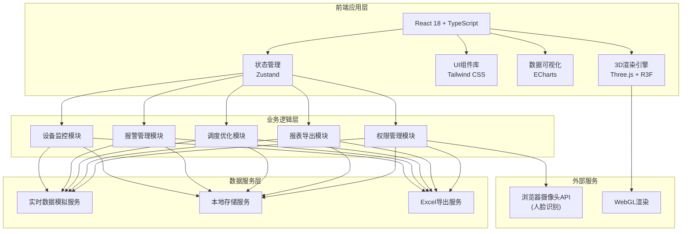

# 3D智慧垃圾焚烧发电厂综合运营与环保监管可视化平台 - 技术架构文档

## 1. 架构设计



## 2. 技术栈说明

### 2.1 核心技术栈
- **前端框架**：React 18 + TypeScript 5
- **构建工具**：Vite 5
- **3D渲染引擎**：Three.js r160 + @react-three/fiber 8 + @react-three/drei 9
- **3D后处理**：@react-three/postprocessing + postprocessing
- **样式方案**：Tailwind CSS 3
- **状态管理**：Zustand 4
- **数据可视化**：ECharts 5
- **Excel导出**：xlsx (SheetJS)
- **图标库**：lucide-react

### 2.2 项目初始化方式
使用 Vite 官方模板初始化 React + TypeScript 项目，然后集成上述依赖。

### 2.3 数据方案
采用前端模拟数据（Mock Data）方案，无需后端服务：
- 实时数据通过 setInterval 模拟更新
- 所有业务逻辑在前端实现
- 配置和历史数据使用 localStorage 持久化

## 3. 目录结构设计

```
src/
├── components/              # 通用UI组件
│   ├── layout/             # 布局组件
│   │   ├── Header.tsx      # 顶部导航栏
│   │   ├── Sidebar.tsx     # 左侧功能菜单
│   │   └── AlarmBar.tsx    # 底部报警栏
│   ├── panels/             # 数据面板组件
│   │   ├── DeviceInfo.tsx  # 设备详情面板
│   │   ├── TrendChart.tsx  # 趋势图表
│   │   └── StatCard.tsx    # 统计卡片
│   └── common/             # 通用组件
│       ├── Button.tsx
│       ├── Modal.tsx
│       └── Table.tsx
├── scene/                  # 3D场景相关
│   ├── Scene.tsx           # 主场景入口
│   ├── models/             # 设备模型组件
│   │   ├── Factory.tsx     # 厂区建筑
│   │   ├── Truck.tsx       # 垃圾车模型
│   │   ├── Incinerator.tsx # 焚烧炉模型
│   │   ├── Boiler.tsx      # 余热锅炉
│   │   ├── Turbine.tsx     # 汽轮发电机
│   │   ├── FlueGas.tsx     # 烟气净化系统
│   │   ├── Pit.tsx         # 垃圾坑模型
│   │   ├── AshBin.tsx      # 灰渣仓
│   │   └── Chimney.tsx     # 烟囱
│   ├── effects/            # 特效组件
│   │   ├── Fire.tsx        # 火焰粒子
│   │   ├── Spray.tsx       # 喷淋特效
│   │   ├── GuideLine.tsx   # 引导光线
│   │   └── AlarmGlow.tsx   # 报警辉光
│   └── controls/           # 控制器
│       └── CameraController.tsx
├── store/                  # 状态管理
│   ├── useAuthStore.ts     # 认证状态
│   ├── useDeviceStore.ts   # 设备数据
│   ├── useAlarmStore.ts    # 报警状态
│   └── useSceneStore.ts    # 场景状态
├── hooks/                  # 自定义Hooks
│   ├── useFaceDetect.ts    # 人脸识别Hook
│   ├── useRealTimeData.ts  # 实时数据Hook
│   └── useAnimation.ts     # 动画Hook
├── utils/                  # 工具函数
│   ├── excel.ts            # Excel导出工具
│   ├── calc.ts             # 计算工具（热值、掺烧等）
│   └── mock.ts             # Mock数据生成
├── types/                  # TypeScript类型定义
│   ├── device.ts
│   ├── alarm.ts
│   └── auth.ts
├── pages/                  # 页面组件
│   ├── Login.tsx           # 登录页
│   ├── ControlRoom.tsx     # 中央控制室
│   ├── TruckDispatch.tsx   # 车辆调度
│   ├── PitMonitor.tsx      # 垃圾坑监控
│   ├── IncineratorMonitor.tsx # 焚烧炉监控
│   ├── TurbineMonitor.tsx  # 汽轮机监控
│   ├── FlueGasMonitor.tsx  # 烟气净化监控
│   ├── AshBinMonitor.tsx   # 灰渣仓监控
│   ├── DeviceManage.tsx    # 设备管理
│   └── ReportCenter.tsx    # 报表中心
├── App.tsx                 # 应用入口
├── main.tsx                # 渲染入口
└── index.css               # 全局样式
```

## 4. 路由定义

| 路由路径 | 页面名称 | 权限要求 |
|-----------|----------|----------|
| /login | 登录页 | 无 |
| / | 中央控制室（首页） | 厂长/部长/环保局 |
| /trucks | 车辆调度 | 厂长/部长 |
| /pit | 垃圾坑监控 | 厂长/部长 |
| /incinerator | 焚烧炉监控 | 厂长/部长/环保局 |
| /turbine | 汽轮发电机监控 | 厂长/部长 |
| /flue-gas | 烟气净化监控 | 厂长/部长/环保局 |
| /ash-bin | 灰渣仓监控 | 厂长/部长 |
| /devices | 设备寿命管理 | 厂长/部长 |
| /reports | 报表中心 | 厂长/部长 |

## 5. 核心数据模型

### 5.1 TypeScript 类型定义

```typescript
// 用户角色类型
type UserRole = 'director' | 'manager' | 'epa';

// 用户信息
interface User {
  id: string;
  name: string;
  role: UserRole;
  faceData?: string;
  lastLogin?: Date;
}

// 垃圾车信息
interface Truck {
  id: string;
  plateNumber: string;
  source: string;
  wasteType: 'household' | 'kitchen' | 'industrial' | 'construction';
  weight: number;
  calorificValue: number;
  status: 'waiting' | 'approaching' | 'discharging' | 'leaving';
  assignedPort?: number;
  arrivalTime: Date;
}

// 垃圾坑区域
interface PitZone {
  id: number;
  name: string;
  height: number;
  fermentationDays: number;
  calorificValue: number;
  wasteType: string;
  color: string;
}

// 焚烧炉数据
interface Incinerator {
  id: number;
  name: string;
  furnaceTemperature: number;
  oxygenContent: number;
  steamFlow: number;
  feedRate: number;
  damperOpening: number;
  runningHours: number;
  status: 'normal' | 'warning' | 'alarm';
}

// 汽轮发电机
interface Turbine {
  id: number;
  name: string;
  vibration: number;
  powerOutput: number;
  rpm: number;
  loadPercent: number;
  runningHours: number;
  status: 'normal' | 'warning' | 'alarm';
}

// 烟气排放数据
interface FlueGasEmission {
  so2: number;
  nox: number;
  particulate: number;
  timestamp: Date;
}

// 烟气净化系统
interface FlueGasSystem {
  id: number;
  emission: FlueGasEmission;
  desulfurizationRunning: boolean;
  denitrificationRunning: boolean;
  sprayActive: boolean;
  status: 'normal' | 'warning' | 'alarm';
}

// 灰渣仓
interface AshBin {
  id: number;
  name: string;
  capacity: number;
  currentLevel: number;
  fillPercent: number;
  status: 'normal' | 'warning' | 'full';
  dispatchTruck?: string;
}

// 报警记录
interface Alarm {
  id: string;
  type: 'temperature' | 'oxygen' | 'vibration' | 'emission' | 'capacity' | 'lifetime';
  deviceId: string;
  deviceName: string;
  level: 'info' | 'warning' | 'critical';
  message: string;
  timestamp: Date;
  resolved: boolean;
  resolvedAt?: Date;
}

// 维修工单
interface WorkOrder {
  id: string;
  deviceId: string;
  deviceName: string;
  type: 'repair' | 'overhaul' | 'maintenance';
  description: string;
  parts: string[];
  status: 'pending' | 'in-progress' | 'completed';
  createdAt: Date;
  completedAt?: Date;
}

// 运营日报
interface DailyReport {
  date: Date;
  totalWasteProcessed: number;
  totalPowerGenerated: number;
  avgEmission: { so2: number; nox: number; particulate: number };
  alarmCount: { warning: number; critical: number };
  deviceExceptionCount: number;
  truckCount: number;
}
```

### 5.2 状态管理设计

使用 Zustand 进行模块化状态管理：

1. **useAuthStore** - 认证状态
   - user: 当前登录用户
   - isAuthenticated: 登录状态
   - login/logout 方法

2. **useDeviceStore** - 设备数据
   - trucks: 垃圾车列表
   - incinerators: 焚烧炉数据
   - turbines: 汽轮机数据
   - flueGasSystems: 烟气净化系统
   - ashBins: 灰渣仓数据
   - pitZones: 垃圾坑区域数据

3. **useAlarmStore** - 报警状态
   - alarms: 报警记录列表
   - activeAlarms: 未处理报警
   - addAlarm/resolveAlarm 方法

4. **useSceneStore** - 场景状态
   - selectedDevice: 当前选中的设备
   - cameraView: 当前相机视角
   - animationState: 动画播放状态

## 6. 核心算法逻辑

### 6.1 智能卸料口分配算法
```
输入：垃圾车信息（垃圾类型、热值、重量）
输出：最优卸料口编号
逻辑：
1. 分析垃圾热值区间
2. 检查各卸料口对应坑区的当前热值分布
3. 计算各区掺烧需求缺口
4. 优先分配到热值互补的坑区
5. 考虑坑区容量余量
6. 返回最优卸料口
```

### 6.2 最佳掺烧比例计算
```
输入：各坑区垃圾量、热值、发酵天数
输出：各区取料比例
逻辑：
1. 设定目标热值范围：1800-2200 kcal/kg
2. 计算各区热值加权平均值
3. 线性规划求解最优混合比例
4. 考虑发酵天数优先级（发酵7-10天优先）
5. 输出掺烧比例并可视化
```

### 6.3 超限自动调整逻辑
```
焚烧炉温度>1000℃：
  → 模型变红闪烁
  → 自动降低给料量（-10%~-30%）
  → 增大风门开度
  → 生成温度超限报警

含氧量<6%：
  → 模型变红闪烁
  → 增大风门开度
  → 适当降低给料量
  → 生成含氧量报警

汽轮机振动超标：
  → 自动降负荷
  → 生成维修工单
  → 推送负责人
```

## 7. 3D性能优化策略

1. **模型优化**：使用低多边形模型，合理设置LOD
2. **材质优化**：复用材质，使用InstancedMesh渲染重复物体
3. **动画优化**：关键帧动画，避免每帧计算复杂逻辑
4. **渲染优化**：合理设置像素比，后处理效果按需开启
5. **内存管理**：及时释放不用的几何体和材质

## 8. 安全设计

1. **人脸数据**：仅本地存储特征值，不上传原始图像
2. **权限隔离**：路由级权限校验，敏感操作二次确认
3. **操作日志**：所有关键操作记录时间、用户、操作内容
4. **数据防篡改**：环保数据使用哈希校验
